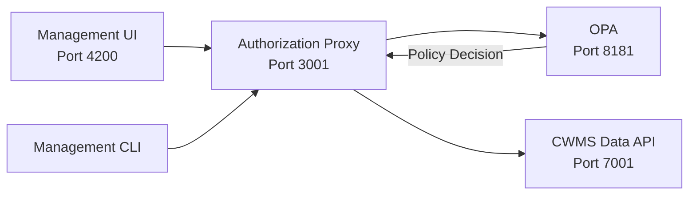

# CWMS Access Management

Authorization proxy and access control system for CWMS Data API.

## Overview

The CWMS Access Management system provides transparent authorization for CWMS Data API using Open Policy Agent (OPA)
with a whitelist-based approach. It intercepts API requests, evaluates authorization policies, and adds a single
authorization context header before forwarding to the downstream API.

## Quick Start

```bash
# Install dependencies
pnpm install

# Configure environment
cp .env.example .env
./scripts/load-whitelist.sh

# Start services
podman compose -f docker-compose.podman.yml up -d

# Verify it's working
curl http://localhost:3001/health
curl http://localhost:3001/cwms-data/offices
```

**First time?** See the complete [setup guide](docs/setup.md) for detailed instructions.

## Architecture



### Key Components

| Component               | Port | Description                                               |
| ----------------------- | ---- | --------------------------------------------------------- |
| **Management UI**       | 4200 | Web interface for viewing users, roles, and policies      |
| **Management CLI**      | -    | Command-line tool for administration tasks                |
| **Authorization Proxy** | 3001 | Transparent proxy that intercepts and authorizes requests |
| **OPA**                 | 8181 | Policy engine for authorization decisions                 |
| **Redis**               | 6379 | Caches authorization decisions for performance            |
| **CWMS Data API**       | 7001 | Downstream API being protected                            |

## Management Applications

### Management UI

Web-based interface for viewing authorization policies, users, and roles.

- **Access**: [http://localhost:4200](http://localhost:4200)
- **Tech Stack**: React 18 + Vite + TypeScript + Tailwind CSS
- **Documentation**: [apps/web/management-ui/README.md](apps/web/management-ui/README.md)

### Management CLI

Command-line tool for managing authorization policies, users, and roles.

- **Executable**: `./dist/apps/cli/management-cli/index.cjs`
- **Tech Stack**: Node.js 24 + TypeScript + Commander + Ink
- **Documentation**: [apps/cli/management-cli/README.md](apps/cli/management-cli/README.md)

## Documentation

### Getting Started

- [Setup Guide](docs/setup.md) - First-time setup and prerequisites
- [Development Guide](docs/development.md) - Local development workflow
- [Container Operations](docs/container-operations.md) - Docker/Podman commands reference
- [Troubleshooting](docs/troubleshooting.md) - Common issues and solutions
- [Performance](docs/performance.md) - Performance tuning and monitoring

### Service Documentation

- [Configuration Guide](apps/services/authorizer-proxy/docs/configuration.md) - Environment variables and settings
- [OPA Whitelist Guide](apps/services/authorizer-proxy/docs/opa-whitelist-guide.md) - Whitelist pattern and endpoint
  configuration
- [Authentication](apps/services/authorizer-proxy/docs/authentication.md) - JWT and Keycloak integration

## Project Structure

```text
cwms-access-management/
├── apps/
│   ├── web/
│   │   └── management-ui/         # Web-based management interface
│   ├── cli/
│   │   └── management-cli/        # Command-line management tool
│   └── services/
│       └── authorizer-proxy/      # Transparent authorization proxy
├── policies/
│   └── cwms_authz.rego            # OPA authorization policies
├── scripts/
│   └── load-whitelist.sh          # Load whitelist configuration
├── docs/                           # Project documentation
├── tools/
│   └── postman/                   # Postman test collections
├── .env.example                    # Environment template
├── opa-whitelist.json             # Whitelist configuration
└── docker-compose.podman.yml      # Container orchestration
```

## Prerequisites

- **Node.js 24+**
- **pnpm 10.15.1+**
- **Podman or Docker**
- **CWMS Infrastructure** - Complete the setup from the
  [cwms-data-api repository](https://github.com/HydrologicEngineeringCenter/cwms-data-api) first:
  - Oracle Database (cwmsdb) running on port 1521
  - CWMS Data API (data-api) running on port 7001
  - Keycloak (auth) running on port 8080
  - Traefik (traefik) running on port 8081

**Note**: The authorization proxy requires a running CWMS Data API instance. Set up the cwms-data-api project before
proceeding.

**Recommended**: Use [mise](https://mise.jdx.dev/) to manage tool versions:

```bash
mise install  # Installs Node 24 and pnpm 10.15.1
```

## Quick Commands

```bash
# Development
pnpm dev                                    # Run authorization proxy with hot reload
pnpm nx serve management-ui                 # Run management UI
pnpm nx serve management-cli                # Run management CLI

# Build
pnpm nx build authorizer-proxy
pnpm nx build management-ui --configuration=production
pnpm nx build management-cli --configuration=production

# Test
pnpm nx test authorizer-proxy
pnpm nx test management-ui

# Containers
podman compose -f docker-compose.podman.yml up -d    # Start all services
podman logs -f authorizer-proxy                      # View logs
podman compose -f docker-compose.podman.yml down     # Stop all services
```

See the [development guide](docs/development.md) for complete command reference.

## Next Steps

1. Complete [first-time setup](docs/setup.md)
2. Review the [development guide](docs/development.md)
3. Read about [OPA whitelist configuration](apps/services/authorizer-proxy/docs/opa-whitelist-guide.md)
4. Explore [management applications](apps/web/management-ui/README.md)

## Support

For issues and troubleshooting:

1. Check the [troubleshooting guide](docs/troubleshooting.md)
2. Review container logs: `podman logs authorizer-proxy`
3. Verify configuration: `cat .env`

## License

See LICENSE file for details.
