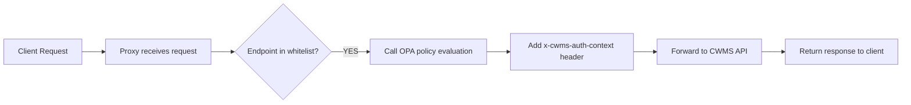
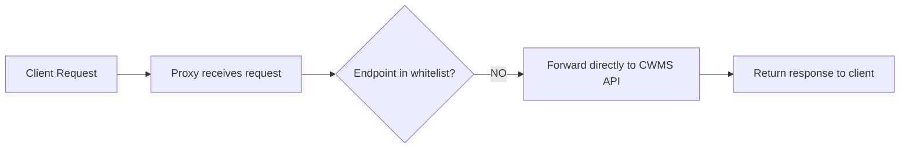

# OPA Whitelist Configuration

The authorization proxy uses a whitelist pattern where only specified endpoints go through OPA policy evaluation. All other endpoints bypass OPA and act as a transparent proxy.

## Configuration

The whitelist is configured via the `OPA_WHITELIST_ENDPOINTS` environment variable as a JSON array of endpoint paths.

### Setup

```bash
# Copy example and customize
cp opa-whitelist.example.json opa-whitelist.json

# Edit with your endpoints
vi opa-whitelist.json

# Load into .env
./scripts/load-whitelist.sh

# Restart service
podman compose -f docker-compose.podman.yml restart authorizer-proxy
```

### Format

```json
[
  "/cwms-data/timeseries",
  "/cwms-data/offices",
  "/cwms-data/locations"
]
```

- Use full URL paths including `/cwms-data` prefix
- Paths must match exactly (without query parameters)
- Keep `opa-whitelist.json` in version control

## Request Flow

### Whitelisted Endpoint



### Non-Whitelisted Endpoint



## Verification

### Check Whitelist Configuration

```bash
# View whitelist in logs
podman logs authorizer-proxy | grep "whitelist"
```

Expected output:

```json
{
  "whitelistedEndpoints": ["/cwms-data/timeseries", "/cwms-data/offices"],
  "count": 2,
  "msg": "OPA authorization whitelist configured"
}
```

### Test Whitelisted Endpoint

```bash
curl http://localhost:3001/cwms-data/timeseries
podman logs authorizer-proxy --tail 5 | grep "whitelist"
```

Should show: `"Endpoint in OPA whitelist - running authorization"`

### Test Non-Whitelisted Endpoint

```bash
curl http://localhost:3001/cwms-data/parameters
podman logs authorizer-proxy --tail 5 | grep "bypassing"
```

Should show: `"Endpoint not in OPA whitelist - bypassing authorization"`

## Common Endpoints

See `opa-whitelist.example.json` for full list.

**Core:**

- `/cwms-data/timeseries`
- `/cwms-data/locations`
- `/cwms-data/levels`
- `/cwms-data/offices`

**Config:**

- `/cwms-data/parameters`
- `/cwms-data/units`
- `/cwms-data/timezones`

**Specialized:**

- `/cwms-data/basins`
- `/cwms-data/pools`
- `/cwms-data/projects`
- `/cwms-data/ratings`
- `/cwms-data/streams`
- `/cwms-data/forecasts`
- `/cwms-data/gates`
- `/cwms-data/outlets`

## Troubleshooting

### Whitelist Not Loading

If you see: `Failed to parse OPA_WHITELIST_ENDPOINTS, using empty whitelist`

**Cause:** Invalid JSON format

**Solution:**

```bash
# Validate JSON syntax
jq . opa-whitelist.json

# Common issues:
# - Missing comma between elements
# - Extra comma at end of array
# - Missing quotes around strings
```

### All Requests Bypassing OPA

**Check whitelist is loaded:**

```bash
podman logs authorizer-proxy | grep "count"
# Should show count > 0
```

**Verify environment variable:**

```bash
podman exec authorizer-proxy env | grep OPA_WHITELIST
# Should show the full JSON array
```

**Check endpoint path format:**

- Whitelist uses full paths: `/cwms-data/timeseries`
- Request path must match exactly (without query parameters)
- Paths are case-sensitive
