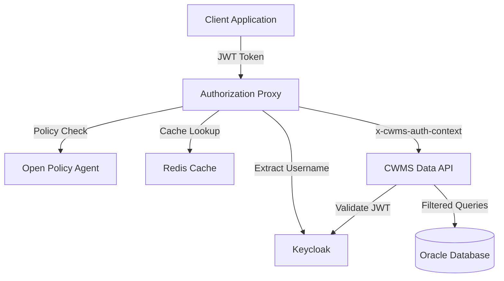
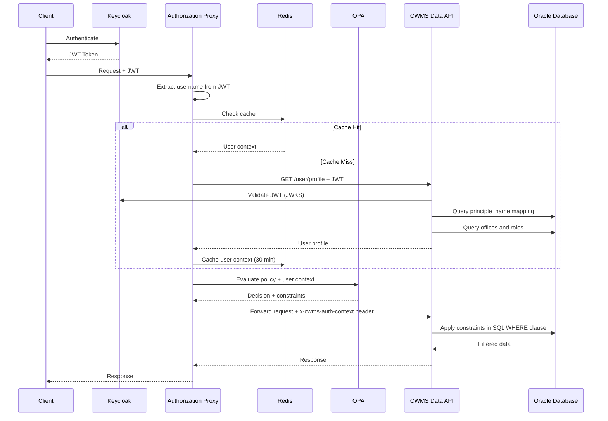
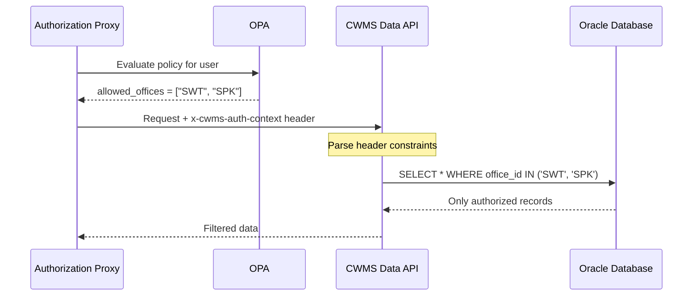
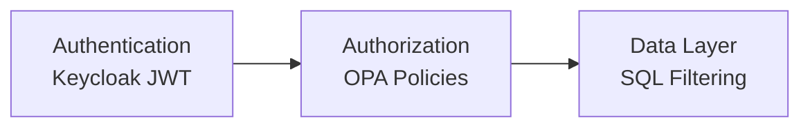

# CWMS Access Management Architecture

## Overview

The CWMS Access Management system provides fine-grained authorization for the CWMS Data API using a transparent proxy
pattern with Open Policy Agent (OPA) for policy evaluation.

## System Architecture



## Authentication Flow



## Authorization Components

### Authorization Proxy (TypeScript)

**Responsibilities**:

- Extract JWT tokens from requests
- Query user context from CDA API (with caching)
- Evaluate authorization policies via OPA
- Add authorization context header
- Forward requests to CDA

### Open Policy Agent (OPA)

**Policy Structure**:

```text
policies/
├── cwms_authz.rego              # Main orchestrator
├── personas/
│   ├── public.rego              # Anonymous access
│   ├── dam_operator.rego        # Operational staff
│   ├── water_manager.rego       # Management staff
│   ├── data_manager.rego        # Regional managers
│   ├── automated_collector.rego # Data collection systems
│   ├── automated_processor.rego # Data processing systems
│   └── external_cooperator.rego # External partners
└── helpers/
    ├── offices.rego             # Office metadata
    └── time_rules.rego          # Embargo rules
```

**Policy Decisions**:

- `allow: true/false` - Whether request is authorized
- `constraints` - Filtering constraints passed to CDA:
  - `allowed_offices` - Which offices user can access
  - `embargo_rules` - Time-based data restrictions
  - `embargo_exempt` - Whether user bypasses embargoes
  - `time_window` - Time range restrictions
  - `data_classification` - Classification levels allowed

### Redis Cache

- Key format: `user:context:{username}`
- TTL: 1800 seconds (30 minutes)
- Reduces database load by 95%
- 10x performance improvement (2ms vs 20ms)

### CWMS Data API (Java)

**Modifications**:

- Parse `x-cwms-auth-context` header
- Apply office-based filtering in SQL WHERE clauses
- Validate JWT tokens via Keycloak JWKS
- Return user profiles via `/user/profile` endpoint

**Note**: CDA does NOT make authorization decisions. Only applies constraints from header.

## Data Flow

### Server-Side Filtering



## User Personas

| Persona             | Access Pattern                          | Example Use Case                   |
| ------------------- | --------------------------------------- | ---------------------------------- |
| Dam Operator        | Single office, shift-based, manual data | Operational data entry 6am-6pm     |
| Water Manager       | Multiple offices, embargo exempt        | Review embargoed data              |
| Data Manager        | Regional access (multiple offices)      | Manage data for SWD division       |
| Limited User        | Minimal access                          | Test access denial                 |
| General User        | Single office, standard permissions     | View public and internal data      |
| Automated Collector | Write-only, API key auth                | Automated data collection          |
| Automated Processor | Read-all offices, system account        | Data processing across all offices |
| External Cooperator | Limited parameters, single office       | External partner data access       |

See [user-personas.md](user-personas.md) for complete details.

## Security Model

### Defense in Depth



1. **Authentication Layer** (Keycloak)
   - JWT token issuance and validation
   - Token signature verification via JWKS

2. **Authorization Layer** (OPA)
   - Policy-based access control
   - Persona-driven authorization rules

3. **Data Layer** (CDA)
   - Server-side constraint enforcement
   - SQL-level filtering

### Principal Mapping

Each Keycloak user is mapped to a CWMS database user:

```text
Keycloak User UUID: 6d67d18b-cb05-468b-99d7-28f6133beee4

Database principle_name:
  'http://localhost:8080/auth/realms/cwms::6d67d18b-cb05-468b-99d7-28f6133beee4'
```

**Note**: Subject UUIDs are randomly generated per Keycloak instance and must be queried dynamically by
`initialize-test-users.sh`.

## Technology Stack

| Component           | Technology                      |
| ------------------- | ------------------------------- |
| Authorization Proxy | Node.js 24, TypeScript, Fastify |
| Policy Engine       | OPA 0.68.0                      |
| Cache               | Redis 7.x                       |
| Data API            | Java 11                         |
| Database            | Oracle 23c Free                 |
| Authentication      | Keycloak 19.0.1                 |
| Build System        | Nx 20.x, pnpm 10.15.1           |
